# 🛠️ MAC（Multi-Agent CAD）：用 1% 的 token 生成可打印的 3D 模型

> Tsinghua University · IEI Lab

> 4 个 agent 协作 · token 砍 116× · 特征通过率 99.3% —— 把简洁的自然语言直接变成可打印的 3D 模型。

[](https://opensource.org/licenses/MIT)
[](https://www.python.org/downloads/)
[](https://github.com/gumyr/build123d)


> **同等的 CAD 生成能力，1/116 的 token、1/13 的推理成本。**

| | [CAD Skills](https://github.com/earthtojake/text-to-cad) | MAC (ours) | 优势 |
|---|---:|---:|---:|
| Tokens | 103.9M | **896k** | **116× ↓** |
| Cost | ¥125.69 | **¥9.67** | **13× ↓** |
| Pass rate | 97.9% (138/141) | **99.3%** (140/141) | ↑ |

---

**🎬 Web UI 全流程演示**

下面是 Web UI 一次完整 pipeline 运行的录屏。

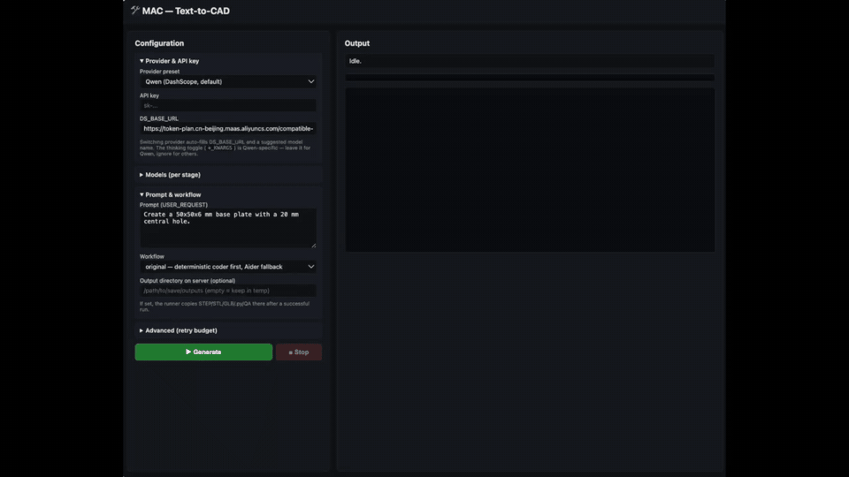

## 📖 目录
- [1. 📸 实物打印画廊](#1-实物打印画廊)
- [2. 🚀 快速上手](#2-快速上手)
- [3. 💡 项目简介](#3-项目简介)
- [4. ✨ 核心优势](#4-核心优势)
- [5. 📝 学术引用](#5-学术引用)

---

## 1. 📸 实物打印画廊

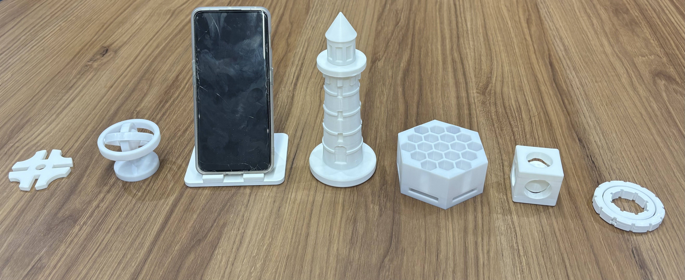

下方 10 个基准测试零件（P1–P10，与 [earthtojake/text-to-cad](https://github.com/earthtojake/text-to-cad) 同源 prompt）、10 件演示画廊（S1–S10，原创 prompt）与 1 个可动演示均由 MAC 流水线生成。上图实物打印模型的 3D 旋转视图与 prompt 见 [qwen3.7_token.md](docs/qwen3.7_token.md)。

### 🤖 可动样例（print-in-place articulable）

打印即装配的多体可动模型 —— 多个独立实体在同一个 STEP 内通过 0.4–1 mm 微小间隙实现"印完即可动"，无需后续组装。这是单 agent 单实体生成之外更难的场景：不仅要分别建模多个 body，还要精确控制 clearance 让运动副功能化。

| 描述 | 实拍图 |
|---|---|
| **笼中小球玩具（Ball-in-Cage Fidget Toy）**<br>经典一体化打印解压玩具：实心球被关在立方笼内，一次打印成形 —— 球可自由滚动但无法脱出。<br>• 40×40×40 mm 立方笼，内部 16 mm 半径球形空腔，居中于原点<br>• 15 mm 半径实心球，与笼内壁四周保持 1 mm 间隙<br>• 六面各开一个 12 mm 半径通孔，便于观察和触摸小球<br><br>**可动陀螺仪玩具（Articulable Gyroscope Toy）**<br>一体化打印的旋转结构：内环通过两根 pivot pin 在外环内自由旋转。<br>• 外环：30 mm 外 / 23 mm 内半径，高 10 mm，居中于 XY 平面<br>• 外环上沿 X 轴开两个 2.4 mm 半径的 pivot 孔<br>• 内旋转体：22 mm 外 / 15 mm 内半径，高 10 mm，内壁 8 个凹槽<br>• 两根 pivot pin（半径 2.0 mm，长 6 mm）向外伸入外环孔内<br>• 0.4 mm 径向间隙使内环绕 X 轴 360° 自由旋转 | 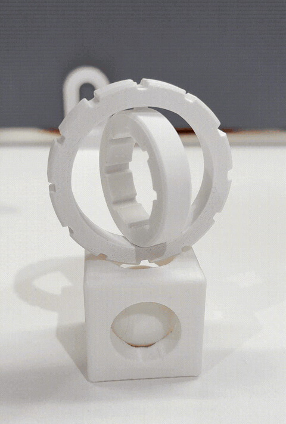 |

### 🎨 演示画廊（S1–S10）

10 个演示零件，展示 MAC 在创意打印品上的能力 —— 装饰摆件、可动玩具、机械机构等。与 P1–P10（同源 prompt）不同，这些 prompt 为本项目原创。详细 prompt 与 3D 旋转视图见 [qwen3.7_token.md](docs/qwen3.7_token.md)。

| S1 | S2 | S3 | S4 | S5 |
|---|---|---|---|---|
| 蜂巢收纳座 | 陀螺仪摆件 | 灯塔摆件 | 手机支架 | 笼中小球 |
| 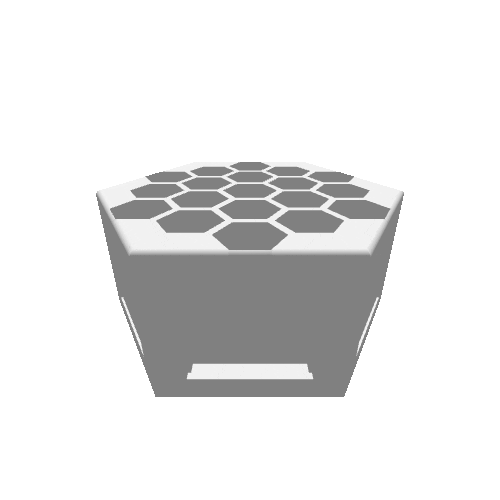 | 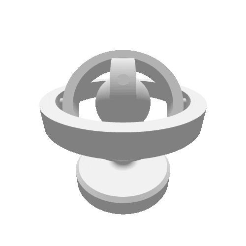 | 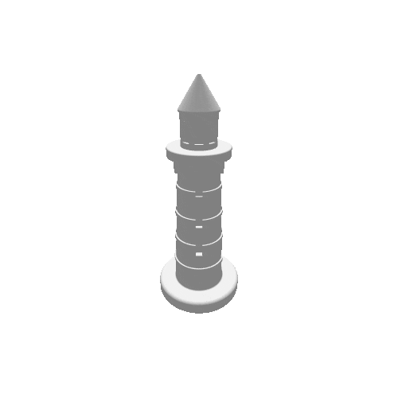 |  | 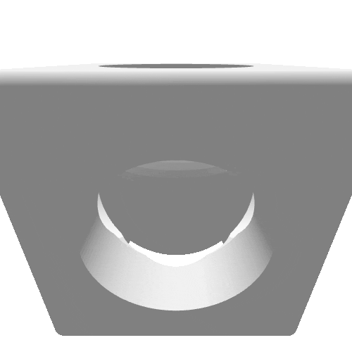 |

| S6 | S7 | S8 | S9 | S10 |
|---|---|---|---|---|
| 可动陀螺仪 | 多环链 | 马尔他机构 | 等离子反应堆 | 通风刹车盘 |
| 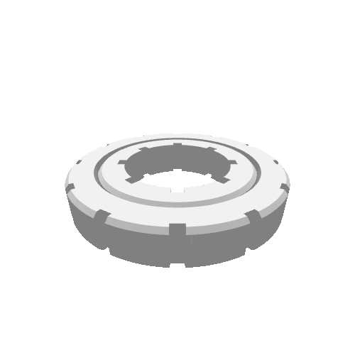 |  |  |  | 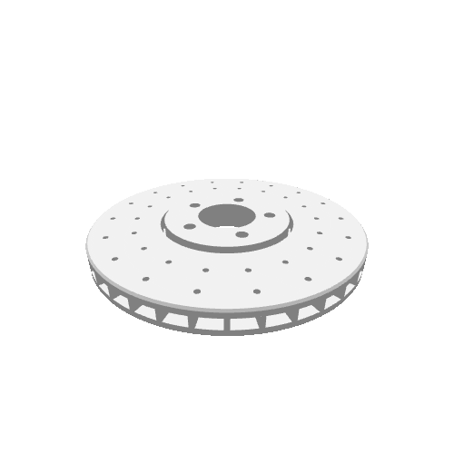 |

### 📐 基准测试零件（P1–P10）

10 个机械零件涵盖阵列特征、布尔运算、旋转阵列、螺旋扫掠、多体装配等典型 CAD 操作。下方演示模型均由本项目根据 [earthtojake/text-to-cad](https://github.com/earthtojake/text-to-cad)（CAD skill）提供的 prompt 生成。详细 prompt 与每条几何特征通过率见 [qwen3.7_token.md](docs/qwen3.7_token.md)。

#### Benchmark 模型视图

| P1 | P2 | P3 | P4 | P5 |
|---|---|---|---|---|
| 带通孔的矩形块 | 圆形法兰 | L 形支架 | 阶梯轴 | 顶部开放外壳 |
|  | 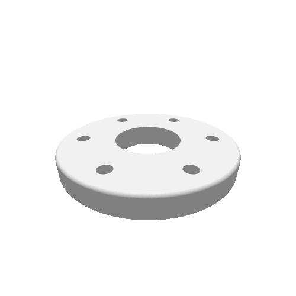 |  |  |  |
| ¥5.53 → **¥0.31** (17.8×) | ¥8.07 → **¥0.34** (23.7×) | ¥13.07 → **¥1.08** (12.1×) | ¥6.53 → **¥0.57** (11.5×) | ¥2.88 → **¥0.36** (8.0×) |

| P6 | P7 | P8 | P9 | P10 |
|---|---|---|---|---|
| 航空 U 形支架 | 径向发动机气缸 | 离心叶轮 | 微型螺旋楼梯 | 行星齿轮组件 |
|  |  | 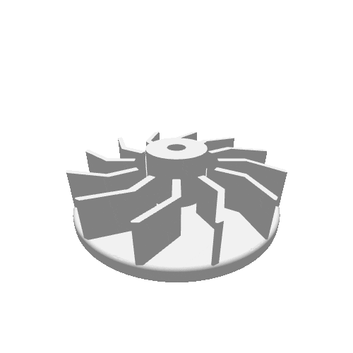 |  | 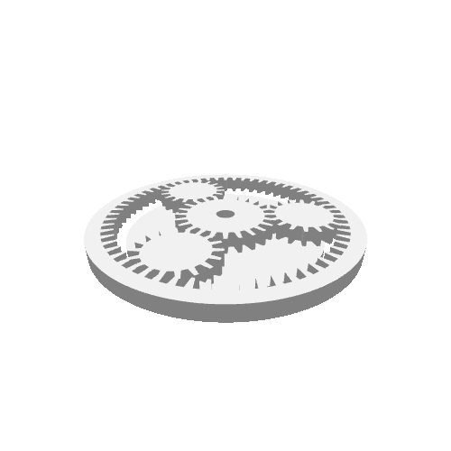 |
| ¥15.21 → **¥3.10** (4.9×) | ¥17.42 → **¥0.53** (32.9×) | ¥32.75 → **¥1.20** (27.3×) | ¥12.80 → **¥1.45** (8.8×) | ¥11.43 → **¥0.73** (15.7×) |

> 单 prompt 成本（CNY）：**CAD Skills → MAC**（成本降低倍数）。总计：**¥125.69 → ¥9.67（13.0×）**。原始数据见 [docs/qwen3.7_token.md](docs/qwen3.7_token.md)。

> 设计你自己的打印品！参见 [§2 快速上手](#2-快速上手) 了解如何生成模型。

---

## 2. 🚀 快速上手

### 安装

```bash
git clone https://github.com/Pan-Chera/Multi-Agent-CAD
cd Multi-Agent-CAD
conda env create -f environment.yml
conda activate multi_agent_cad
pip install --no-deps "aider-chat==0.82.3"
```

最后一步 `pip install` 是必需的：PyPI 上所有 `aider-chat` 版本都硬 pin `numpy==1.26.4`（1.x），与 `build123d` 的 `numpy>=2` 要求冲突，conda 的 pip 子进程无法绕过这个 pin，所以 `aider-chat` 没放进 `environment.yml`。`--no-deps` 跳过该 pin；aider 0.82.3 在 numpy 2.x 上能正常 import（上游 pin 过度保守）。

> **pip 用户（无 conda）**：`aider-chat` 锁定 `numpy==1.26.4`，与 `build123d>=0.8` 要求的 `numpy>=2,<3` 冲突，纯 pip 直接装失败。走以下 workaround（已在 macOS arm64 + Python 3.11 验证）：
>
> ```bash
> python3.11 -m venv .venv
> source .venv/bin/activate          # Windows PowerShell: .venv\Scripts\activate
> pip install --upgrade pip
> # 先装 aider（会拉 numpy 1.26.4 + 一堆传递依赖），再强制覆盖 numpy 到 2.x。
> # 已验证 aider 0.82.3 在 numpy 2.x 上能正常 import——上游的 pin 是过度保守。
> pip install "aider-chat==0.82.3"
> pip install --no-deps --force-reinstall "numpy>=2,<2.3"
> pip install "build123d>=0.8" "langgraph>=0.2,<0.3" "langgraph-checkpoint>=2.0,<3.0" \
>             "pydantic>=2.5" "openai>=1.20.0" "anthropic>=0.30" \
>             "trimesh>=4.0" "rtree>=1.1" "scipy>=1.10" "scikit-learn>=1.3" \
>             "fastapi>=0.110" "uvicorn[standard]>=0.27" "ipython>=8.15" "pytest>=7.4"
> # --no-deps 跳过 pyproject.toml 的 numpy pin 重新检查；fastapi+uvicorn 已由上一步装好。
> pip install --no-deps -e .
> ```
>
> 最后一步同时注册 `mac-config-reset` 命令行脚本、并允许在任意目录（不只是仓库根）跑 `python -m multi_agent_cad.graph`。完整依赖清单见 [requirements.txt](requirements.txt) / [pyproject.toml](pyproject.toml)。

> **Windows**：在 Windows 上同样的 `conda env create` + `pip install --no-deps aider-chat==0.82.3` 流程可用——`trimesh` 和 `rtree` 来自 conda-forge 预编译包；`OCP` 由 `build123d` 的 PyPI 依赖 `cadquery-ocp-novtk` 传递性拉入。Windows 上不要走下面的纯 pip workaround——`trimesh`/`rtree` 的 native wheel 在 Windows 上不可靠。PowerShell 设 API key：`$env:DASHSCOPE_API_KEY = "sk-..."`（cmd.exe 用 `set DASHSCOPE_API_KEY=sk-...`）。conda 环境内跑 Web UI 用 `pip install -e ".[web]"`——`uvloop` 在 Windows 上自动跳过。Windows 不在 CI 里，但代码避开 Unix 专属 API、全程 UTF-8；遇到问题欢迎反馈。

### 配置

编辑 [multi_agent_cad/config.py](multi_agent_cad/config.py)：

| 字段 | 作用 |
|---|---|
| `DS_API_KEY` | API key（或设环境变量 `DASHSCOPE_API_KEY`，优先级更高） |
| `USER_REQUEST` | 默认 CAD 生成需求 |
| `DS_BASE_URL` + 4 个阶段的 `MODEL` / `TEMPERATURE` / `MAX_TOKENS` / `KWARGS` | provider 与每阶段模型参数（见 [§4 混合路由](#-混合路由--每阶段独立选模调用更自由二次开发空间更大)） |

配置改坏时一键恢复默认：

```bash
python -m multi_agent_cad._config_defaults --reset
```

### 🔌 可接入任意 LLM provider

MAC 通过 **OpenAI 兼容端点**调用模型。仓库默认指向阿里云百炼（`qwen3.7-max`）。把两个配置字段指向任意 provider，整条流水线随之切换：

> **下表的模型名与端点地址仅为示例。** 实际使用前请到各家 provider 后台核对确切的 model ID（DashScope 控制台 / OpenAI models API 等）——像 `qwen3.7-max` 这样的名字未必与当前线上版本对得上。

| Provider | `DS_BASE_URL` | `*_MODEL` 示例 | 说明 |
|---|---|---|---|
| OpenAI | `https://api.openai.com/v1` | `gpt-5.6` | `DASHSCOPE_API_KEY` 填 OpenAI key；`*_KWARGS = {}` |
| DeepSeek | `https://api.deepseek.com/v1` | `deepseek-v4-pro` | OpenAI 兼容 |
| Google Gemini | `https://generativelanguage.googleapis.com/v1beta/openai/` | `gemini-3.6-flash` | OpenAI 兼容端点 |
| 本地（Ollama） | `http://localhost:11434/v1` | `qwen3-coder:32b` | 无需 API key |
| Anthropic Claude | 经 OpenAI 兼容网关（OpenRouter / LiteLLM 代理） | `claude-sonnet-4-6` | Aider 修复阶段可经 litellm 原生支持 Claude |

以 OpenAI 为例，编辑 [config.py](multi_agent_cad/config.py)：

```python
DS_BASE_URL = "https://api.openai.com/v1"
SPEC_PLANNER_MODEL = ARCHITECT_MODEL = CODER_MODEL = REPAIR_MODEL = "gpt-5.6"
# 关闭 Qwen 专属的思维链开关：
SPEC_PLANNER_KWARGS = ARCHITECT_KWARGS = CODER_KWARGS = REPAIR_KWARGS = {}
# Aider 阶段（litellm 前缀模型名）：
AIDER_MODEL = "openai/gpt-5.6"
```

然后导出 key（环境变量名是历史遗留——接受任意 OpenAI 兼容 key）：

```bash
export DASHSCOPE_API_KEY="sk-..."              # bash / zsh
# PowerShell:  $env:DASHSCOPE_API_KEY = "sk-..."
```

> **关于模型名 `qwen3.7-max`**——它只是所配置端点上的模型 ID，此处指阿里云百炼的旗舰推理模型。每个 `*_MODEL` 字段都接受你所选 provider 暴露的任意模型 ID，代码中没有任何 Qwen 专属逻辑。唯一的 Qwen 专属项是 `*_KWARGS` 里的 `enable_thinking` 开关——换其它 provider 时设 `*_KWARGS = {}`（[config.py](multi_agent_cad/config.py) 内附更多 provider 示例）。

### 两种运行方式

MAC 的同一套流水线既可从终端、也可从浏览器 UI 驱动。产出相同，体验不同——按需选择：

| | 终端 | Web UI |
|---|---|---|
| 适用场景 | 中途介入修改 | 直观预览、更好上手 |
| 中途注入修改 / 停止 | ✅ 每次 QA 后 10s checkpoint（`1` 自动 / `2` 注入 / `3` 停止） | ❌ 仅自动迭代 |
| 3D 预览结果 | ❌ 需外部工具打开 STEP/STL | ✅ 浏览器内 `<model-viewer>` + 一键下载 |
| 配置方式 | 编辑 [config.py](multi_agent_cad/config.py) | 表单填写 |
| 输出位置 | 仓库根目录（`temp_*`） | 每任务临时目录（可选拷到指定路径） |

详见下方 [终端](#终端) 与 [Web UI](#-web-ui)。

### 终端

```bash
python -m multi_agent_cad.graph          # 原始工作流：确定性 coder 优先，Aider 兜底
python -m multi_agent_cad.graph_aider    # 修改工作流：在已有 temp_design*.py 上应用 USER_REQUEST 的修改需求
```

两个入口都会流式打印 LangGraph 事件，每次 QA 后给 10 秒选择（超时自动迭代）：按 `1` 自动迭代、`2` 注入修改需求、`3` 停止并保留当前产物。

跑完后根目录生成：

| 文件 | 内容 |
|---|---|
| `temp_output_0.step` / `.stl` | 最终模型 |
| `temp_design_0.py` | 生成的 build123d 源码 |
| `temp_measurements_0.json` | 白盒特征测量 |
| `temp_missed_0.json` | 运行时诊断 |

更复杂示例 prompt 见 [§1 画廊](#1-实物打印画廊)。

### 🖥️ Web UI

浏览器的图形界面——填配置表单、运行、3D 预览 GLB、下载产物。UI 跑在浏览器里，流水线跑在服务器上（单用户、受信网络——生成的 `.py` 会在服务器端执行）。

```bash
pip install -e ".[web]"                       # 安装 fastapi + uvicorn
python -m multi_agent_cad.web                 # 监听 http://0.0.0.0:8000
```

从本机浏览器打开 `http://<服务器>:8000`。若在不受信网络远程访问，用 SSH 隧道：`ssh -L 8000:localhost:8000 user@server`，然后本机打开 `http://localhost:8000`。

### 缓存机制

`pipeline_cache/` 存储前两个阶段的产出，让重跑省时省钱：

| 文件 | 来源 | 作用 |
|---|---|---|
| `cad_brief.json` | Spec Planner（阶段 1） | 解析后的需求结构化数据 |
| `architect_plan.json` | Geometric Architect（阶段 2） | 几何方案（草图、步骤、选择器） |

**重跑同一 prompt**：直接 `python -m multi_agent_cad.graph` —— 命中缓存跳过前两个 LLM 阶段，从 Python Coder 开始重新生成代码并跑修复循环。如果上次 QA 失败 / Aider 修复跑偏，重跑就能用相同的 plan 再试一次，几秒内出结果。

**生成不同模型**：cache 只检查文件是否存在、不比对 `USER_REQUEST` 内容。所以改了 prompt 不删 cache，会继续用旧 plan 生成旧模型。换模型前必须清缓存：

```bash
rm pipeline_cache/cad_brief.json pipeline_cache/architect_plan.json
```

或代码层面绕过：在 [multi_agent_cad/graph.py](multi_agent_cad/graph.py) 的 `get_default_initial_state` 中设 `force_refresh: True`。

### 自定义 prompt

编辑 [multi_agent_cad/config.py](multi_agent_cad/config.py) 的 `USER_REQUEST`，例如：

```python
USER_REQUEST = "Create a single solid circular flange as a STEP model in millimeters. The flange is a cylinder with an outside diameter of 80 mm and a thickness of 10 mm. Add a central vertical through-bore with diameter 30 mm."
```

改完后按上面 [缓存机制](#缓存机制) 的说明清缓存，再 `python -m multi_agent_cad.graph`。

---

## 3. 💡 项目简介

近期基于 LLM 的 text-to-CAD agent 已能生成复杂模型，但推理成本高昂：长上下文交互反复消费文档、对话历史和调试栈。

**瓶颈不是 CAD 能力，而是低效的推理组织。** 单 agent 跑 10 prompt 基准测试消耗 **103M tokens、1,307 次 API 调用**。

**MAC** 把生成过程拆成 4 个 agent，由 LangGraph 状态机串联。agent 之间只传紧凑结构化状态（`CADBrief`、`ArchitectPlan`、QA 报告），不传对话原文，把 token 用量压到 1/116：

| 阶段 | Agent | 输入 | 输出 |
|---|---|---|---|
| 1 | **Spec Planner** | 自然语言需求 | `CADBrief` JSON（仅 3 类验证目标） |
| 2 | **Geometric Architect** | `CADBrief` | `ArchitectPlan` JSON（草图、步骤、选择器） |
| 3 | **Python Coder** | `ArchitectPlan` | `temp_design.py`（确定性翻译器优先，Aider 兜底） |
| 4 | **Autonomous Skill Loop** | 代码 + STEP/STL | 最终 STEP + 双引擎 QA 报告（Aider 修复循环） |

每个 agent 只看自己职责所需的小型、结构化快照 —— 没有共享的臃肿上下文。幻觉传播在阶段边界处被切断：即使一个 agent 出错，下一阶段也只会从结构化输出继续工作，而不会承接上一个 agent 的叙事文本。

**10 个 prompt / 141 个特征的基准测试结果（Qwen 3.7-max，CNY）：**

| 指标 | 单 agent 基线 | **MAC** | 比率 |
|---|---:|---:|---:|
| 总成本 | 125.69 | **9.67** | 便宜 13× |
| 总 token 数 | 103,950,189 | **896,340** | 少 116× |
| API 调用次数 | 1,307 | **50** | 少 26× |
| 特征通过率 | 97.9% (138/141) | **99.3%** (140/141) | — |

MAC 同时是一个白盒系统：每个中间产物（`CADBrief`、`ArchitectPlan`、`temp_design.py`、`temp_measurements_*.json`、`temp_missed_*.json`、QA 报告）都序列化到磁盘，可供人工审计。你可以在每次迭代的 checkpoint 处介入，覆盖通过的结果，并直接把额外的修改需求喂给 Aider 修复 prompt。

完整基准方法论、每 prompt 的 token/成本明细、公平性分析与失败模式分析见 [quantified_quality.md](docs/quantified_quality.md) / [quantified_quality_cn.md](docs/quantified_quality_cn.md)。

---

## 4. ✨ 核心优势

### 为什么 token 效率是核心指标？

CAD 生成天生是多轮迭代过程：代码生成 → 执行 → 错误分析 → 修复 → 再生成。Naive agent 在每一轮都把完整对话历史（prompt + build123d 文档 + 错误栈）重新塞进上下文，token 随迭代轮数指数膨胀，单次推理成本可能从几分钱涨到几块钱。MAC 通过传递结构化状态而非原始对话，把 token 增长压成线性 —— 同样的多轮迭代，总成本下降 13×，总 token 下降 116×，特征通过率反而提升到 99.3%。

### 🚀 结构化状态传递，而非上下文反复阅读 —— 13× token 效率
每个 agent 的输入是上一阶段的结构化 JSON 产出（`CADBrief`、`ArchitectPlan`），不是重新塞满的对话历史。Spec Planner 只读用户需求；Architect 只读 `CADBrief`；Coder 只读 `ArchitectPlan`；Aider 只读 QA 错误报告 + `build123d_reference.md`。没有任何 agent 需要反复阅读完整对话历史。在 10 个 prompt 基准测试中，这把总 token 数从 **103.9M → 0.90M（116×）**、总成本从 **¥125.69 → ¥9.67（13×）** 降下来，同时把特征通过率从 97.9% 提升到 99.3%。

### 🔍 白盒透明度 —— 任意阶段可审计或修改
每个中间产物都在磁盘上：[pipeline_cache/cad_brief.json](pipeline_cache/cad_brief.json)、[pipeline_cache/architect_plan.json](pipeline_cache/architect_plan.json)、`temp_design_*.py`、`temp_measurements_*.json`（白盒特征尺寸）、`temp_missed_*.json`（运行时诊断，分类为 `MISSED_CUT` / `FILLET_FAILED` / `CHAMFER_FAILED`）、QA 报告。Autonomous Skill Loop 还暴露了一个**迭代 checkpoint** —— 每次 QA 完成后打印 STEP/STL 路径、QA 状态，并提供 10 秒窗口让用户选择自动迭代 / 用户介入 / 停止。中途介入时，你的修改需求会原样前置到 Aider 修复 prompt。

### 🧠 混合路由 —— 每阶段独立选模，调用更自由，二次开发空间更大
传统单 agent 把所有任务（需求解析、几何设计、代码生成、错误修复）压在一个模型上，只能选一个"全能型"昂贵模型。MAC 把这 4 个阶段解耦，**每个阶段可以独立选择模型**（见 [config.py](multi_agent_cad/config.py) 的 `SPEC_PLANNER_*` / `ARCHITECT_*` / `CODER_*` / `AIDER_*` / `REPAIR_*` 块，每块都有独立的 `MODEL` / `TEMPERATURE` / `MAX_TOKENS` / `KWARGS`，如思维链开关）：

- **Spec Planner**（需求解析）这种"读一段文字、产出结构化 JSON"的简单工作，可以挂便宜的轻量模型或本地小模型
- **Geometric Architect**（几何设计）和 **Python Coder**（代码生成）这种需要空间想象和算法推理的复杂工作，才挂 qwen3.7-max 这类强模型
- **Aider Repair**（错误修复）可以换 Claude/GPT 这类擅长代码的模型，甚至自训一个专攻 build123d 修复的本地模型

更进一步 —— 由于阶段间只通过结构化 JSON 交接（`CADBrief`、`ArchitectPlan`），**任何一个阶段都可以被替换为你自训的专攻模型，而不影响其他阶段**。例如训一个只读 `CADBrief` 输出 `ArchitectPlan` 的小模型替代 Architect 阶段的 qwen 调用，单次成本从 ~¥0.5 降到接近零。这在单 agent 架构下做不到 —— 单 agent 的 prompt 和上下文深度耦合，无法只替换其中一环。

### 🛡️ 确定性翻译器 —— 常见 CAD 操作零 token

LLM-only CAD agent 每次生成代码都要烧 token。MAC 反其道而行：用确定性翻译器 [`_plan_to_code`](multi_agent_cad/nodes.py) 把 Coder 阶段的"读 JSON 写代码"工作完全脱离 LLM —— 直接从 `ArchitectPlan` 翻译成 build123d 代码，**零 token 成本**。支持 `extrude`、`revolve`、`hole`、`boolean_union/cut`、`pattern_linear/circular`、`mirror`、`fillet`、`chamfer`、`shell` 等常见 CAD 操作；只有不支持的步骤类型（`draft`、`rib`、无 `control_points` 的自定义多边形）才生成 `# TODO_AIDER` 占位符由 Aider 填充。

这是 token 用量降到 1/116 的关键之一：常见几何操作走翻译器，只在边界情况调用 LLM。这也是 §4.4 混合路由的极致——把 Coder 阶段的模型调用降到零。

默认配置：Qwen 3.7-max，Planner/Coder/Repair 开启 thinking，Architect 关闭 thinking 以保证 JSON 确定性。

### ⏱️ 时间更快 —— 约 10×

Token 效率（116×）和 API 调用次数减少（26×）直接转化为时间优势：要生成的内容更少、与 LLM 的往返次数更少。未做正式 benchmark，但在 10 个 prompt 上 MAC 的总耗时大约是单 agent 基线的 1/10。10× 仅作量级估计，非实测数据。

完整流水线图（Mermaid）、GraphState 定义、各阶段设计理据与关键实现特性见 [multi_agent_cad/WORKFLOW.md](multi_agent_cad/WORKFLOW.md)。

---

## 5. 📝 学术引用

如果你觉得本项目对你的研究有帮助，请考虑引用：

```bibtex
@misc{mac2026,
  author = {Guanxing Qu and Xueyan Zou},
  title  = {MAC (Multi-Agent CAD): A Decoupled Multi-Agent Framework for Text-to-CAD Generation},
  year   = {2026},
  publisher = {GitHub},
  journal   = {GitHub repository},
  howpublished = {\url{https://github.com/Pan-Chera/Multi-Agent-CAD}}
}
```

本项目的量化评测以 [earthtojake/text-to-cad](https://github.com/earthtojake/text-to-cad)（CAD Skills）为对比基线。如果您的论文引用了 MAC，建议同时引用该项目：

```bibtex
@misc{texttocad2026,
  author = {earthtojake},
  title  = {CAD Skills: A skills library for CAD, robotics, and hardware design agents},
  year   = {2026},
  publisher = {GitHub},
  journal   = {GitHub repository},
  howpublished = {\url{https://github.com/earthtojake/text-to-cad}}
}
```

---

## 📄 许可证

MIT —— 见 [LICENSE](LICENSE)。

内置的 [`packages/cadpy`](packages/cadpy) STEP/GLB 运行时源自 [earthtojake/text-to-cad](https://github.com/earthtojake/text-to-cad)（CAD Skills），按其原始 MIT 协议再分发——见 [packages/cadpy/LICENSE](packages/cadpy/LICENSE)。

## 🙏 致谢

- [Tsinghua University, IEI Lab](https://maureenzou.github.io/lab.html) —— 本项目所属实验室，提供研究环境与导师指导
- [earthtojake/text-to-cad](https://github.com/earthtojake/text-to-cad)（CAD Skills）—— 对比基线 `cad skill` 的来源；本项目的 10 个 benchmark prompt（P1–P10）取自该项目 [benchmarks/](https://github.com/earthtojake/text-to-cad/tree/main/benchmarks) 目录。内置的 [`packages/cadpy`](packages/cadpy) 运行时同样源自该项目，保留其原始 MIT 版权
- [build123d](https://github.com/gumyr/build123d) —— 代数 B-rep CAD 内核
- [LangGraph](https://langchain-ai.github.io/langgraph/) —— 有状态 agent 编排
- [Aider](https://aider.chat/) —— LLM 驱动的代码修复
- [Qwen 3.7-max](https://www.alibabacloud.com/help/en/model-studio/) —— DashScope LLM
