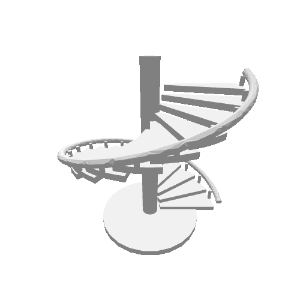
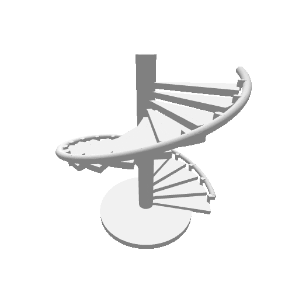

# multi agent cad (MAC) Quantified Quality Report

**Model**: `qwen3.7-max` (DashScope / Alibaba Cloud Bailian)
**Test set**: 10 CAD generation prompts (P1–P10), 141 total geometric features
**Comparison**: `cad skill` (Claude code skills) vs `multi agent cad` (abbreviated MAC, the multi-agent pipeline)
**Currency**: CNY

---

The `cad skill` baseline is the [`cad` skill](https://github.com/earthtojake/text-to-cad/tree/main/skills/cad) from [earthtojake/text-to-cad](https://github.com/earthtojake/text-to-cad) (CAD Skills, [docs](https://www.cadskills.xyz)) — a single-agent text-to-CAD generator built on Claude Code skills.

> **Fairness note**: MAC and the `cad skill` baseline use **the same prompt set** (P1–P10, sourced from [that project's benchmarks/](https://github.com/earthtojake/text-to-cad/tree/main/benchmarks)), **the same test set**, and **the same geometric evaluation criteria** (141 features, binary pass/fail). The only variable is the agent architecture.

> **About the baseline 97.9%**: the original `cad skill` only achieves 97.9%. Reason: the original author tested with Claude and ChatGPT, while this round uses the weaker Qwen 3.7-max. Baseline and MAC share the same LLM, with agent architecture as the only variable — MAC hits 99.3%, edge entirely from architecture.

## 1. Executive Summary

| Metric | cad skill | MAC | Ratio (skill / MAC) |
|---|---:|---:|---:|
| Total cost (CNY) | 125.69 | 9.67 | **13.0×** |
| Total tokens | 103,950,189 | 896,340 | **116.0×** |
| Total input tokens | 5,971,566 | 523,924 | 11.4× |
| Total cache_read tokens | 96,192,896 | 10,496 | 9,165× |
| Total output tokens | 1,785,727 | 361,920 | 4.93× |
| Total API calls | 1,307 | 50 | **26.1×** |
| Features passed / total | 138 / 141 | 140 / 141 | — |
| Feature pass rate | 97.9% | 99.3% | — |
| Failed features | 3 | 1 | — |
| Defensive corrections | 0 | 1 | — |

**Core conclusion**: MAC achieves a **99.3% feature pass rate** (140/141, 1 actual failure + 1 independent defensive correction) at **1/13 the cost and 1/26 the API calls** of the comparison baseline, while consuming **116× fewer tokens**, in less wall-clock time. `cad skill`'s cache_read dominates (96.2M / 103.9M total tokens), indicating heavy context reuse, but absolute cost remains higher. **MAC architecturally blocks the context hallucination accumulation inherent in single-agent systems** (see §5 for details).

---

## 2. Methodology

### 2.1 Feature Extraction

For each prompt, geometric features are extracted from the natural-language spec, **prioritizing qualitative** topology (single-body vs assembly, symmetry type, feature placement, through vs blind, fillet scope) over quantitative dimensions. Each feature is a binary pass/fail item verified against the generated STEP model.

Feature counts per prompt:

| Prompt | Part type | Feature count |
|---|---|---:|
| P1 | Rectangular block + 4 through-holes + top chamfer | 7 |
| P2 | Circular flange + central bore + 6 bolt holes + double fillet | 10 |
| P3 | L-bracket + gussets + bi-directional holes + outer corner fillet | 14 |
| P4 | Stepped shaft + keyway + end chamfer | 11 |
| P5 | Open-top enclosure + 4 standoffs + blind holes + outer fillets | 12 |
| P6 | Aerospace clevis bracket + 2 lugs + lightening cutouts + ribs + dual fillets | 18 |
| P7 | Radial-engine cylinder + 12 fins + flange + top cap + angled boss | 17 |
| P8 | Centrifugal impeller + 12 backward-curved blades + root fillets | 15 |
| P9 | Spiral staircase + 20 treads + handrail + 20 balusters + base | 16 |
| P10 | Planetary gear assembly (5 part types, multi-body) | 21 |
| **Total** | | **141** |

### 2.2 Quality Scoring and Pricing

- **Pass rate** = features_passed / feature_count
- **Failure item** = the specific feature number(s) not satisfied (e.g., "P5 item 11" = feature 11 in P5's list failed)
- **Defensive correction** = a feature originally flagged as implausible but automatically fixed (P9 MAC repaired feature 8 without being prompted)

| Token type | CNY / million tokens |
|---|---:|
| input | 6.0 |
| cache_creation | 7.5 |
| cache_read | 0.6 |
| output | 18.0 |

`Cost = (input × 6 + cache_read × 0.6 + output × 18) / 1,000,000`. cache_creation is zero across all runs (no explicit `cache_control` usage).

---

## 3. Per-Prompt Detailed Data

### 3.1 cad skill (text to cad, Claude Code skill)

| Prompt | Pass | Fail items | Input | Cache_r | Output | Total | API | Cost (CNY) | Pass% |
|---|---|---|---:|---:|---:|---:|---:|---:|---:|
| P1 | 7/7 | — | 212,689 | 5,413,760 | 55,878 | 5,682,327 | 112 | 5.53 | 100.0% |
| P2 | 10/10 | — | 412,097 | 6,625,536 | 89,885 | 7,127,518 | 126 | 8.07 | 100.0% |
| P3 | 14/14 | — | 457,731 | 8,393,600 | 293,629 | 9,144,960 | 113 | 13.07 | 100.0% |
| P4 | 11/11 | — | 206,212 | 6,293,248 | 84,450 | 6,583,910 | 106 | 6.53 | 100.0% |
| P5 | 11/12 | item 11 | 199,344 | 1,961,344 | 27,957 | 2,188,645 | 53 | 2.88 | 91.7% |
| P6 | 16/18 | items 16, 18 | 677,783 | 12,261,248 | 210,211 | 13,149,242 | 171 | 15.21 | 88.9% |
| P7 | 17/17 | — | 809,241 | 13,545,088 | 246,802 | 14,601,131 | 150 | 17.42 | 100.0% |
| P8 | 15/15 | — | 2,089,788 | 21,905,920 | 392,906 | 24,388,614 | 211 | 32.75 | 100.0% |
| P9 | 16/16 | — | 487,907 | 10,189,056 | 208,818 | 10,885,781 | 135 | 12.80 | 100.0% |
| P10 | 21/21 | — | 418,774 | 9,604,096 | 175,191 | 10,198,061 | 130 | 11.43 | 100.0% |
| **Total** | 138/141 | 3 fails | 5,971,566 | 96,192,896 | 1,785,727 | 103,950,189 | 1,307 | **125.69** | 97.9% |

### 3.2 multi agent cad (MAC) (this pipeline)

| Prompt | Pass | Fail items | Input | Cache_r | Output | Total | API | Cost (CNY) | Pass% |
|---|---|---|---:|---:|---:|---:|---:|---:|---:|
| P1 | 7/7 | — | 23,453 | 0 | 9,156 | 32,609 | 3 | 0.31 | 100.0% |
| P2 | 10/10 | — | 24,179 | 0 | 10,648 | 34,827 | 3 | 0.34 | 100.0% |
| P3 | 14/14 | — | 51,886 | 0 | 42,618 | 94,504 | 5 | 1.08 | 100.0% |
| P4 | 11/11 | — | 27,069 | 0 | 22,538 | 49,607 | 3 | 0.57 | 100.0% |
| P5 | 12/12 | — | 25,927 | 0 | 11,430 | 37,357 | 3 | 0.36 | 100.0% |
| P6 | 18/18 | — | 157,815 | 0 | 119,799 | 277,614 | 13 | 3.10 | 100.0% |
| P7 | 17/17 | — | 30,679 | 0 | 19,334 | 50,013 | 3 | 0.53 | 100.0% |
| P8 | 14/15 | item 13 | 80,922 | 0 | 39,733 | 120,655 | 7 | 1.20 | 93.3% |
| P9 | 17/16* | (defensive correction: fixed item 8) | 71,493 | 10,496 | 56,503 | 138,492 | 6 | 1.45 | 100.0%+ |
| P10 | 21/21 | — | 30,501 | 0 | 30,161 | 60,662 | 4 | 0.73 | 100.0% |
| **Total** | 140/141 | 1 fail (P8 item 13) + 1 defensive correction (P9 item 8) | 523,924 | 10,496 | 361,920 | 896,340 | 50 | **9.67** | 99.3% |

\* P9 MAC: 17/16 means "16/16 features satisfied + 1 defensive correction (item 8, originally flagged as physically implausible)". P8 MAC: 14/15 means "1 feature failed (item 13, fillet code conflict)".

---

## 4. Failure Mode Analysis

### 4.1 cad skill failures (3 features across 2 prompts)

| Failure | Prompt | Feature # | Feature description | Likely root cause |
|---|---|---|---|---|
| A | P5 | item 11 | "Inner vertical corners, top edges, and standoffs have no fillets" | skill did not apply fillets to the 4 external vertical corners; instead erroneously applied fillets to the bottom edge of the base plate |
| B | P6 | item 16 | "Lug-to-base transition has smaller-radius fillets" | skill missed the lug-to-base transition fillets |
| C | P6 | item 18 | "Other regions have no fillets" | skill applied fillets to regions that should remain sharp |

**Pattern**: All 3 failures are **fillet scope errors** —— skill either over-applies or under-applies fillets relative to the prompt's specific scoping ("only outside vertical corners", "no fillets on inside corners"). The Claude Code skill struggles with **exclusive feature constraints** ("do not fillet X"). This is not because the model poorly understands negation; more likely, in the bloated context (Context Bloat), those small constraints get diluted and forgotten by the attention mechanism —— see §5 for the architectural analysis.

### 4.2 MAC failure (1 feature across 1 prompt)

| Failure | Prompt | Feature # | Feature description | Likely root cause |
|---|---|---|---|---|
| D | P8 | item 13 | "Blade root fillets (where blades meet the backplate and hub)" | The code does contain this fillet feature, but the fillet generation code errors out on this geometry and the fillet is not successfully applied; moreover, this geometric topology error exceeds the system's maximum auto-repair iteration limit (MAX_RETRIES=5) and is let through |

**Pattern**: MAC's only failure is a **fillet code conflict** —— the code layer does have the implementation of feature 13, but build123d's fillet generation conflicts on this geometry (edge selection / boolean operation conflict), so the fillet is not actually applied. Even though MAC's QA closed-loop detected the failure and repeatedly fed it to Aider for repair, 5 consecutive iterations could not resolve the topology conflict, and the system eventually let it through as "max retry limit reached". This is a code execution layer failure, not a design error or prompt semantic ambiguity.

| Failure comparison | cad skill | MAC |
|---|---|---|
| Failed features | 3 | 1 |
| Failing prompts | 2 (P5, P6) | 1 (P8) |
| Failure type | Fillet scope (exclusive constraint) | Fillet code conflict |
| Recoverable via prompt rewrite? | Yes (3/3 are scope errors, fixable by being more explicit) | No (1/1 is a code conflict, requires fixing the fillet generation code rather than rewriting the prompt) |
| Defensive corrections | 0 | 1 (P9 item 8 —— physical plausibility) |

**P9 item 8 defensive-correction instance**: The original "tread inner end approaches column" design causes floating geometry (the tread and column are only tangent at a single point, with no solid connection), and the model would fracture at that point during 3D printing. MAC proactively corrected this parameter based on physical common sense (keeping a safe overlap between the tread inner end and the column), avoiding model fracture. This is a typical "defensive correction" scenario: the system goes beyond literal execution of the original instruction, prioritizes physical constraints, and proactively avoids designs that would lead to physical failure.

P9 spiral staircase comparison:

| text-to-cad skill (treads disconnected from column) | MAC (safe overlap) |
|---|---|
|  |  |

---

## 5. Cache Utilization and Architectural Difference

cad skill heavily uses prompt caching (cache_read, average hit rate 94.5%, meaning 94.5% of input context is reused across calls); MAC barely uses it (except P9 which used 10,496 cache_read tokens, all prompts have cache_r=0). Even with heavy caching, cad skill still pays 0.6 CNY/M for cache reads —— at 96.2M cache token volume, the cache_read cost alone reaches **57.7 CNY**. MAC's total cost (9.67 CNY) is **6× cheaper than cad skill's cache_read cost alone**.

**Architectural difference dictates caching strategy**: cad skill operates on a **single-agent paradigm that repeatedly reviews memory** —— it stuffs the build123d reference docs + complete conversation history into the context and re-reads them on every call (cache hits cost only 0.6 CNY/M), relying on "re-reading the same large context" to maintain consistency. MAC operates on a **multi-agent paradigm based on the separation of concerns** —— Spec Planner, Architect, Coder, Aider Repair each look only at the small context their role requires (CADBrief / ArchitectPlan / QA error report); the output of one stage becomes the input of the next, with no need to pile all context together for repeated reading.

**Side effects under complex tasks**: When tasks are complex, cad skill's single agent re-reads the same large context, where **existing information interferes with itself**; the model may misread a detail from the previous output as the current requirement, leading to hallucinations or self-contradictory modifications. In MAC, each agent's input is a "snapshot" of the previous stage's structured output (CADBrief JSON, ArchitectPlan JSON), with clear boundaries, so the space for hallucination propagation is cut off —— even if one agent occasionally makes a mistake, the next stage continues working only from the structured output, without accumulating hallucinations into the context.

---

## 6. Token Information Density

Output ratio = output_tokens / input_tokens. In LLM inference, more output is not better (longer output means higher cost and more error-prone). The doubling of this ratio essentially reflects **minimization of the denominator (Input)**, not the numerator (Output) becoming abnormally efficient —— MAC thoroughly eliminates useless redundant context (Noise).

| Prompt | skill output/input | MAC output/input | MAC info density advantage |
|---|---:|---:|---:|
| P1 | 0.263 | 0.390 | 1.48× |
| P2 | 0.218 | 0.440 | 2.02× |
| P3 | 0.641 | 0.821 | 1.28× |
| P4 | 0.410 | 0.833 | 2.03× |
| P5 | 0.140 | 0.441 | 3.15× |
| P6 | 0.310 | 0.759 | 2.45× |
| P7 | 0.305 | 0.630 | 2.07× |
| P8 | 0.188 | 0.491 | 2.61× |
| P9 | 0.428 | 0.790 | 1.85× |
| P10 | 0.418 | 0.989 | 2.37× |
| **Average** | **0.332** | **0.659** | **1.98×** |

**Insight**: MAC's average information density is 1.98× that of cad skill, essentially reflecting that in the MAC architecture, the LLM's compute (Output) is **highly focused on actual code generation**, rather than wasted on re-reading historical error stacks, build123d reference docs, and lengthy conversation history as in single-agent systems. The improvement in this ratio stems from denominator reduction rather than blind numerator expansion —— consistent with §5's architectural conclusion: MAC uses structured small contexts to cut off the low-efficiency loop of "re-reading the same large context".

---

## Appendix A —— Raw Data

Source: [qwen3.7_token.md](qwen3.7_token.md) (10 prompts with feature lists, completion counts, token usage, API call counts, costs).
